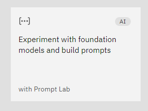
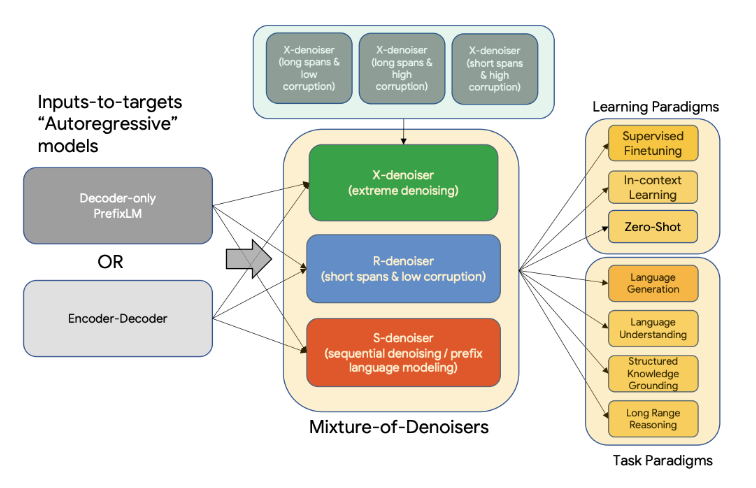
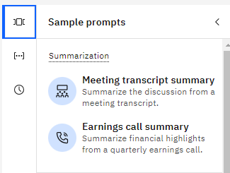
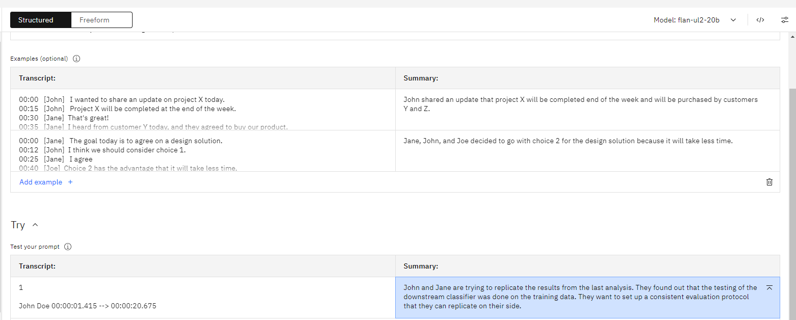
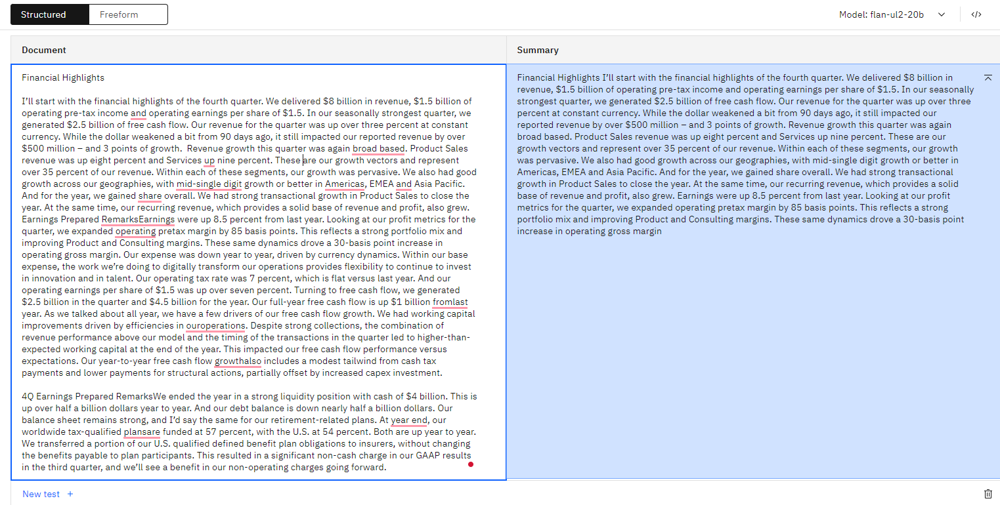
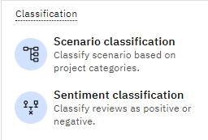
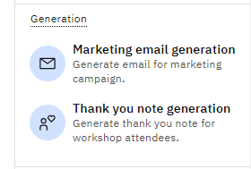
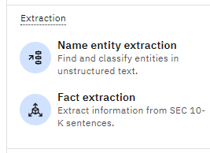
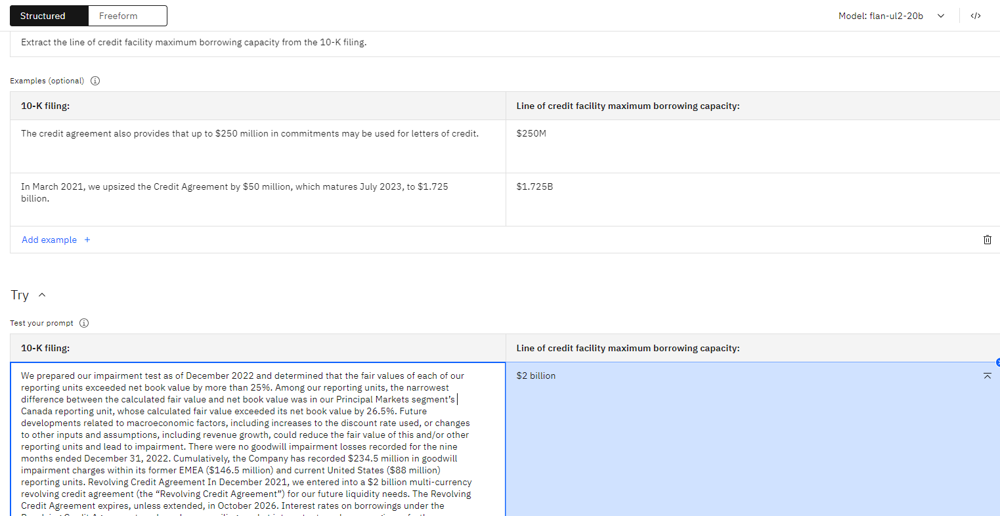

# How to use Generative AI with IBM  WatsonX 

Hello everyone, today we are going to use **IBM watsonx .**

In this blog post we are going to explain how to use Generative AI to **summarize**, **classify**, **extract**, **generate**  and  **answering questions** from a text.

## Introduction

AI refers to the ability of computer systems to attempt to mimic the problem solving and decision making capabilities of the human mind.

- Computer vision
- Data science
- Natural language processing
- Robotics

AI models  have evolved significantly in the past decade

-  Advanced analytics - Step by step logic and instructions coded by human developers. Very Deterministic.- eg. anomaly detection etc.
- Machine Learning - Human crafted features  with supervised learning to analyze data for specific task. eg. prediction price, optimization etc.
- Deep Learning - Unsupervised learning where AI is fed outcomes and data to create rules and algorithms. eg. Image recognition, autonomous driving etc.
- Foundation models- Unsupervised AI that ingest massive amount of data, to then generate net new human-like text, art, images, video, etc. eg. DALL-e ChatGPT, BERT, T5, LaMDA etc.

## When to use Traditional AI Capabilities

- Predictive - Structured data analysis, predictions, forecasting, etc.
- Directed Conversational AI - Deterministic dialog flows for API driven conversational AI
- Computer Vision AI - Machine Vision for object and anomaly detection
- Process Automation -  Robotic Process Automation, Process reengineering and optimization

## When to use Generative AI capabilities

- Summarization eg. documents such as user manuals, asset notes, financial reports etc.
- Conversation Search, eg. SOPs troubleshooting instructions etc.
- Content creation eg. personas, user stories, synthetic data, generating images, personalized UI, marketing copu, email/ social responses etc.
- Code creation. eg. Code co-pilot, code conversion, create technical documentation, test cases etc.

## What you can do  with  Generative AI

- Question answering- Model responds to question in natural language
- Generation - Model generate content in natural language
- Extraction-  Model extract entities facts and info, from text.
- Summarize - Model creates summaries of natural language
- Classification- Models classifies text .eg. sentiment, group, projects etc.

## Generative AI

Class of Machine Learning techniques whose purpose is to generate content or data of many kinds such as audio, code, images, text, simulaitons, 3D objects, and videos.

## The foundation models

An AI model that can be adapted to a wide range of downstream tasks. Foundation models are typically large-scale (eg. billions of parameters) generative models trained on unlabeled data using self-supervision.

In this blog post, we are going to test watsonx.ai

# Step 1 Creation of account

First we need to create our IBM cloud account  here

https://www.ibm.com/products/watsonx-ai

You can start you free trial

## Step 2.  Open Promt Lab

After you are in, you can open a Promt Lab

With the **Foundation Model Libraries**, you can have easy access to IBM propertary and open source Foundation models.

The **Prompt Lab**  you ca experiment with zero/ few-shot learning for enterprises tasks , and with Tunning studio you tailor pre-trained Foundation models for complex downstream tasks on enterprise data.

## Select a foundation model

We can select a model that best fits your needs. All models support English text. 

Among available models we have:

- The **Flan-UL2 model** is an encoder-decoder model based on the T5 architecture. [It has **20 billion parameters**](). It was fine-tuned using the “Flan” prompt tuning and dataset collection.  The original UL2 model was only trained with a receptive field of 512, which made it non-ideal for N-shot prompting where N is large. The Flan-UL2 checkpoint uses a receptive field of 2048 which makes it more usable for few-shot in-context learning. For more details, please see sections 3.1.2 of the [paper](https://arxiv.org/pdf/2205.05131v1.pdf).

  

  

- **BLOOMZ & mT0**, a family of models capable of following human instructions in dozens of languages zero-shot. We finetune BLOOM & mT5 pretrained multilingual language models on our crosslingual task mixture (xP3) and find our resulting models capable of crosslingual generalization to unseen tasks & languages.

- **GPT-NeoX-20B** is a 20 billion parameter autoregressive language model trained on [the Pile](https://pile.eleuther.ai/) using the [GPT-NeoX library](https://github.com/EleutherAI/gpt-neox). Its architecture intentionally
  resembles that of GPT-3, and is almost identical to that of [GPT-J- 6B](https://huggingface.co/EleutherAI/gpt-j-6B). Its training dataset contains a multitude of English-language texts, reflecting the general-purpose nature of this model. More idetails about model architecture (including how it differs from GPT-3),training procedure, and additional evaluations see this [reference](https://arxiv.org/abs/2204.06745).

-  **T5, FLAN-T5** is just better at everything. For the same number of parameters, these models have been fine-tuned on more than 1000 additional tasks covering also more languages.

- **MPT-7B-Instruct2** is a retrained version of the orignal MPT-7B-Instruct model is a short-form instruction following decoder-only model.

  See model cards for [MPT-7B](https://huggingface.co/mosaicml/mpt-7b) and [MPT-7B-Instruct](https://huggingface.co/mosaicml/mpt-7b-instruct) for more information.

In this post we are going to choose the  **Flan-UL2** model. For other supported languages we have check each models.

## Model Parameters

Nucleus sampling is a technique used in large language models to control the randomness and diversity of generated text. It works by sampling from only the most likely tokens in the model’s predicted distribution.

The key parameters are:

- Temperature: Controls randomness, higher values increase diversity.
- Top-p (nucleus): The cumulative probability cutoff for token selection. Lower values mean sampling from a smaller, more top-weighted nucleus.
- Top-k: Sample from the k most likely next tokens at each step. Lower k focuses on higher probability tokens.

In general:

- Higher temperature will make outputs more random and diverse.
- Lower top-p values reduce diversity and focus on more probable tokens.
- Lower top-k also concentrates sampling on the highest probability tokens for each step.

So temperature increases variety, while top-p and top-k reduce variety and focus samples on the model’s top predictions. You have to balance diversity and relevance when tuning these parameters for different applications.

## Step 3 - Choose the sample prompt you want to use.

## Summarization

- Meetings transcript summary - It is summarized the discussions from a meeting transcript.

- Earnings call summary - Summarize financial highlights from earning call

## Classification

- Scenario classification - Classify scenario based on project categories.

  

- Sentiment classification - Classify reviews as positive or negative

## Generation

- Marketing email generation - Generate email for marketing campaign

- Thank you note generation - Generate thank you note for workshop attendees.

## Extraction

- Name entity extraction - Find and classify entities in unstructured text.

- Fact extraction - Extract information from K sentences.

## Question answering

- Questions about an article - Answer questions about a body of text.

**Congratulations!** We have used Generative AI with IBM  WatsonX 